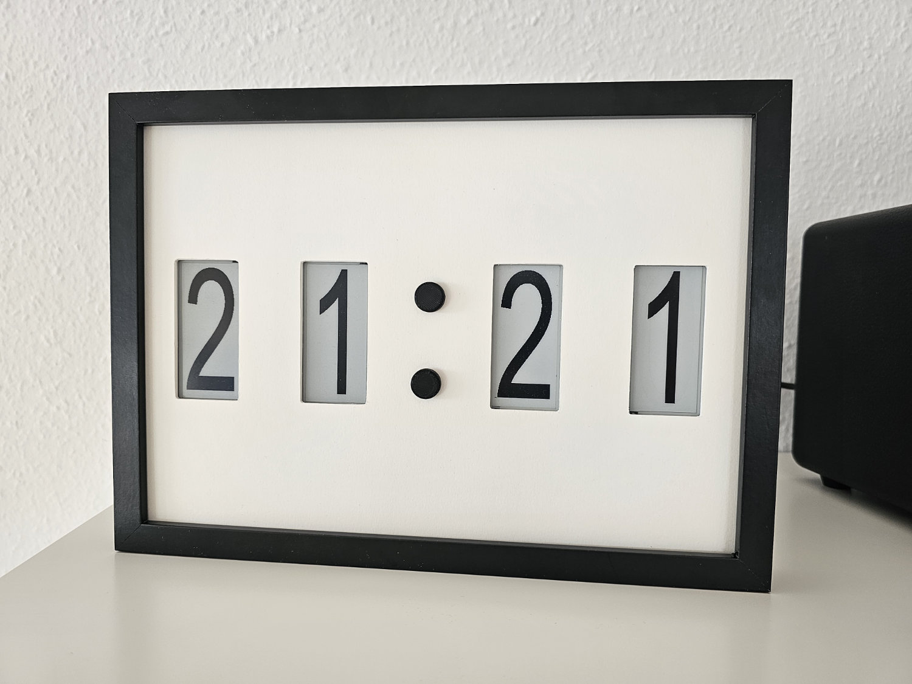
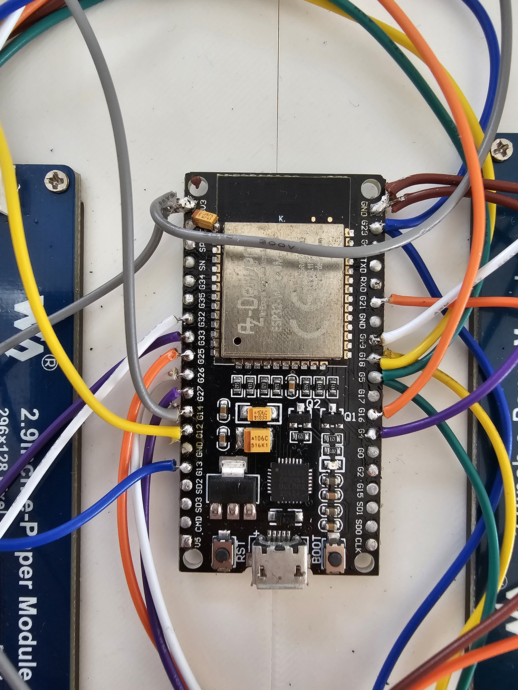
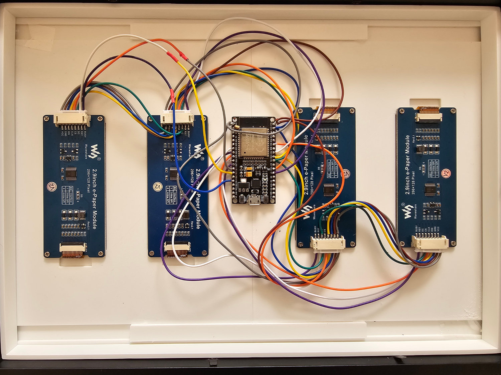

# Configuration

create myWifi.h in 01_src\include`` with the following content, containing your wifi credentials:

```cpp
#ifndef MYWIFI_H_
#define MYWIFI_H_

#define MY_WIFI_SSID "<ssid>"
#define MY_WIFI_PASSWORD "<wifi_password>"

#define NTP_SERVER "pool.ntp.org"

#endif
```

# Wiring Diagram
In case you need to change the pinout, the pin definitions are in `01_src\include\board.h`.




# Parts List
- picture frame 30x40 cm ([IKEA RÖDALM](https://www.ikea.com/de/de/p/roedalm-rahmen-schwarz-20548918/))
- ESP32 Dev Kit (e.g. [AZDelivery ESP32 NodeMCU](https://www.az-delivery.de/en/products/esp32-developmentboard))
- 4x Wavesahre 2.9inch e-Paper Display ([Waveshare 2.9inch e-Paper Display](https://www.waveshare.com/wiki/2.9inch_e-Paper_Module))

# 3D Printing

The 3D printing pars are available in the `02_cad` and on [Printables](https://www.printables.com/model/1162687/).

Parts:
- 2x connector (PLA)
- 2x front panel (PLA, white)
- 2x dot (PLA, black)

# Assembly
To hide the small gap between the front panels I used a big sheet of white paper and cut the display holes into it. The paper is then glued to the back of the front panel.

# Editing the Digit Font

The font file as Affinity Designer file is available in the res directory. To convert the exported images to bitmaps you may use this [tool](https://javl.github.io/image2cpp/). Th bitmaps can be found in `01_src\include\bitmaps.h`.